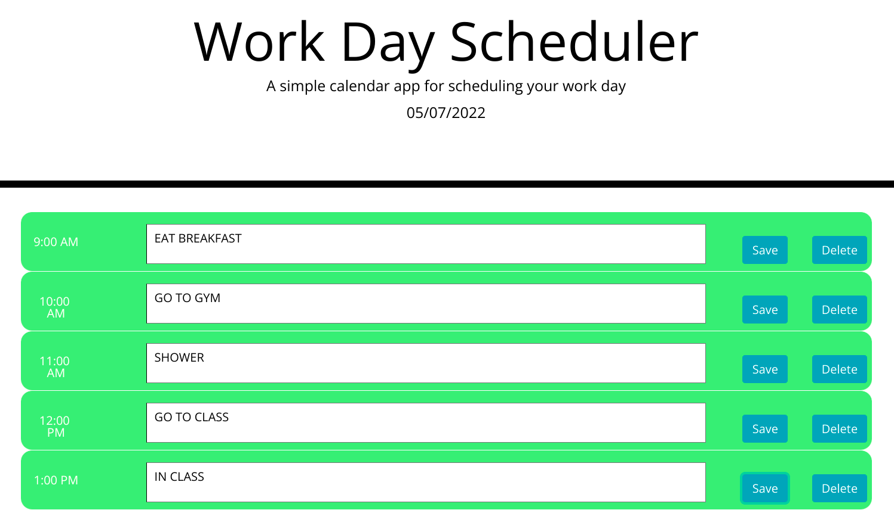

# workday-scheduler
## Description
This program allows you to schedule events during the business hours of 9am to 5pm.
These events will save to your local storage so even if you refresh the page they remain.
The site also implements moment.js and is color coded for past, present, and future.

## Screenshot

## Link
https://gabefando.github.io/workday-scheduler/
